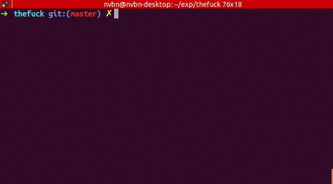

# TheFuck

## 效果



## 安装

::: code-group

```bash [Linux, macOS]
brew install thefuck
```

```bash [Windows]
pip install thefuck
```

:::

## 问题

将此命令放置在您的 .bashrc 或 $profile 其他启动脚本中

::: code-group

```bash [ Git Bash ]
export PYTHONIOENCODING="utf-8"

eval $(thefuck --alias)
```

```bash [ Powershell ]

$env:PYTHONIOENCODING="utf-8"

iex "$(thefuck --alias)"
```

:::
